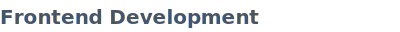
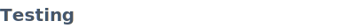

# ✌ Wassup, stranger!

My name is Maxim. I'm a Fullstack & DevOps Engineer from Kazakhstan, occasionally working with embedded systems (STM32, Rust).

Badges powered by [readme-kit](https://www.npmjs.com/package/readme-kit). Which is MY OWN library!

**Foundation:** HTML5, CSS3, JavaScript

---

maximgriven@gmail.com · [LinkedIn](https://linkedin.com/in/maximgriven)
